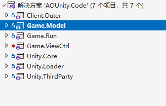
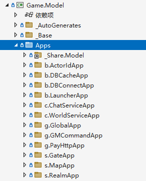
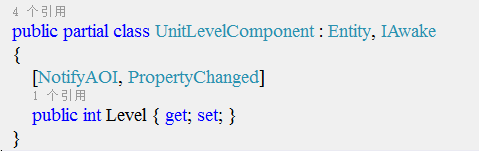
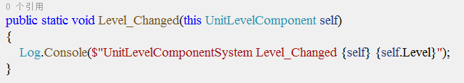
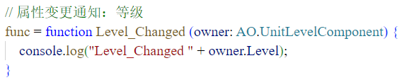

# AOGame
base on ET framework(基于ET框架魔改的一个框架)

---框架尚在开发当中---
<br>

## 框架目标：做一个高开发效率的框架（High Efficiency）
- 人生苦短我用xx，这句话放在任何地方都是对的
- 任何重复且麻烦的事情都是错误的事情
- 人的时间是有限的，我们应该在有限的时间做更多有价值的事情
- AOGame的目标就是尽量把开发效率做到极致
- 随着AI生成技术的发展，个人的开发能力会被成倍放大，在这种情况下个人的开发效率会变得更加重要，更有竞争力


## [Accelerate Auto Obvious]
【加速 自动 清晰】
<br>

---
# AOGame保留了ET框架的核心ECS模块、事件模块、网络模块以及消息模块等<br>也就是说AOGame与ET框架的底层是差不多的，AOGame仅在业务层及业务结构方面做了调整
<br>

# demo运行流程
安装mongodb数据库，编译服务器并运行，打开Unity的Init场景并运行，即可登录游戏
<br>
<br>

# 以下是一些主要的改动和调整：
- 调整程序集结构
- Scene流程拆分调整
- Unit拆分调整
- 消息调用接口生成
- 实体组件、属性自动同步
- 分离网络Session相关为单独程序集
- 接入PuerTs脚本方案（仅用于ui逻辑编写，核心玩法仍使用C#编写并基于HybridCLR热更方案）
- 接入Luban表格配置方案
- 接入EGamePlay技能系统
- 实现了一个简单的BundleFile资源管理系统
- 引入AOP面向切面编程流程
- 以及其他


---
# 调整程序集结构
AOGame将代码工程改回ET5那样的前后端分离的结构

服务端程序集没有大的改动，主要设定Game.Model为模型层，Game.Run为逻辑层，并单独拆分网络Session模块为Server.Outer程序集，这是为了让业务程序集专注于业务相关


客户端则去掉为了实现热重载额外添加的镜像程序集，转而通过将程序集切换到无效平台实现编辑器下的dll热重载

同样设定Game.Model为模型层，Game.Run为逻辑层，并单独拆分网络Session模块为Client.Outer程序集，另外设定Game.ViewCtrl为视图逻辑程序集



# Scene和Unit拆分调整
AOGame将ET的Scene拆分成App和Scene，App表示业务应用，App又进一步拆分成各个类型App，例如RealmApp、GateApp、MapApp等，Scene则单独表示场景Scene。

AOGame将ET的Unit拆分成Avatar、Npc和ItemUnit，Avatar表示玩家地图单位，Npc表示非玩家地图单位（怪物也属于Npc单位），ItemUnit表示其他非生命地图单位。

为什么要拆分Scene和Unit？实体的类型和类型实体的不同。

- 实体的类型即功能一样的用同一实体辅以字段区分不同类型，比如场景Scene或物品Item，包子和馒头就是功能一样的Item，都有着相同的字段，只是字段的值不一样，id和name的值不一样，物品的功能都一样所以用同一实体统一管理。

- 类型实体即功能有所差别的用不同类型实体辅以接口判断归类，比如App，MapApp和GateApp虽然都是IApp，但是他们的功能有非常大的差别，所以用类型实体流程分而治之。

# App进程
从下图我们可以非常清晰明了的看到组成整个游戏服的所有类型App
- 前缀 b 表示base，基础服。
- 前缀 c 表示center，中心服，一个区只有一个。
- 前缀 g 表示global，全局服，整个分布式服务机制里只有一个。
- 前缀 s 表示serve，游戏的主要业务服。



# Client模式
走向不固定，可叠加的状态，可使用模式机制，比如ClientMode客户端模式

# 流程 WorkFlow
走向固定，互斥且不可叠加的状态，可使用流程WorkFlow，比如回合制的战斗流程，开始-进行-结束

CombatFlowLauncher

ToBranch

# 消息调用接口生成
AOGame添加消息调用接口生成流程，通过生成AvatarCall类及方法去发送消息

客户端可以这样发送消息请求
```csharp
var response = AvatarCall.C2M_SpellRequest(new C2M_SpellRequest() { CastPoint = hitPoint, SkillId = 1002 });
```

服务端可以这样推送消息给客户端
```csharp
newAvatar.ClientCall.M2C_CreateMyUnit(new M2C_CreateMyUnit() { Unit = unitInfo });
```

# 实体组件、属性自动同步



- 当组件属性加上NotifySelf特性，属性的变化会自动同步给自己的客户端

- 当组件属性加上NotifyAOI特性，属性的变化会自动同步给AOI内的客户端，包括自己

- 当组件属性加上PropertyChanged特性，属性的变化会触发逻辑层的响应（仅客户端）

- C#代码会如此响应（仅客户端）：



- Ts代码会如此响应（仅客户端）：



属性变化的同步和响应都是基于AOP面向切面编程实现的，可以减少许多重复的代码

# BundleFile资源管理系统
下面是BundleFile资源管理系统主要的脚本
- ArtFilesConfig脚本收集资源打组并构建AssetBundle
- ArtFilesUpdater脚本更新下载版本资源
- Asset脚本加载资源


# 参考引用
- https://github.com/egametang/ET
- https://github.com/m969/EGamePlay
- https://github.com/focus-creative-games/luban
- https://github.com/focus-creative-games/hybridclr
- https://github.com/Tencent/puerts